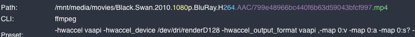

# Tdarr-LXC-Proxmox

### Tdarr Setup using a LXC Container in Proxmox 8.3.5 Hypervisor

#### System

- AMD Ryzen 5 4600G # Onboard APU
- Socket AM4
- 6 Core - 12 Threads
- TRUENAS with 3 x shares

> movies
>> tv
>>> transcode


##### Create a Tdarr LXC using [Proxmox Helper Scripts]([https://](https://tteck.github.io/Proxmox/#tdarr-lxc))

> 2 cores
>> 8 gig ram
>>> 50 gig SSD

**Note- I used a priviliged container as its easier to add hardware accelleration and NFS shares.  As I am not exposing this to the outside world this LXC should be not be in fear of exposure to the host Proxmox Debian kernal.**

> Use [Cockpit](https://cockpit-project.org/) install to manage NFS shares. Easier than editing `/etc/fstab`
>> Read documentation. Easy install

```markdown
sudo apt install cockpit
```

#### Shares

- movies
- tv
- transcode # You need this as its the transcode cache

> Default port 8265

```markdown
http://ip_address:8265
```


### Tdar Hardware Transcode - Avoid CPU Transcoding

- FFMPEG VAAPI HEVC Transcode plugin
- This plugin will transcode usinf Ryzen APU HVEC x.265 8 Bit. 
- It will not change the container - Mkv and Mp4 stay as is.
- Audio does not change format



See image above. As long as its GPU transcoding with dev/dri/renderD128 it should be ok.


